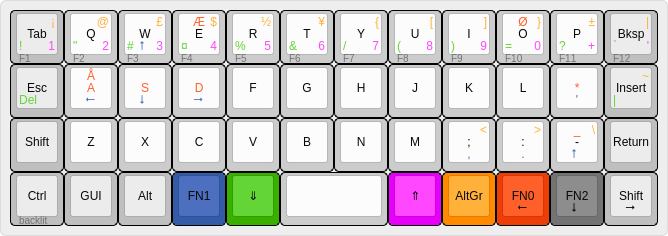

# The Nordic Planck Layout
_Created by Kim Schulz <kim@mechkeys.tech> - see https://mechkeys.tech for more info_

This layout is inspired by the Nordic ISO layout so most keys are placed to be somewhat near their normal location. 

## Features: 
 * single mod-key access to F1-F12, 0-9 and AltGr symbols (all of them places on top row)
 * Æ Ø Å placed on FN0 and E O A
 * Works with ISO Nordic keymap settings in Win/linux/Mac

## TODO:
 * Change to use tap-dance for Æ Ø Å
 * Add description of ajustment layer

